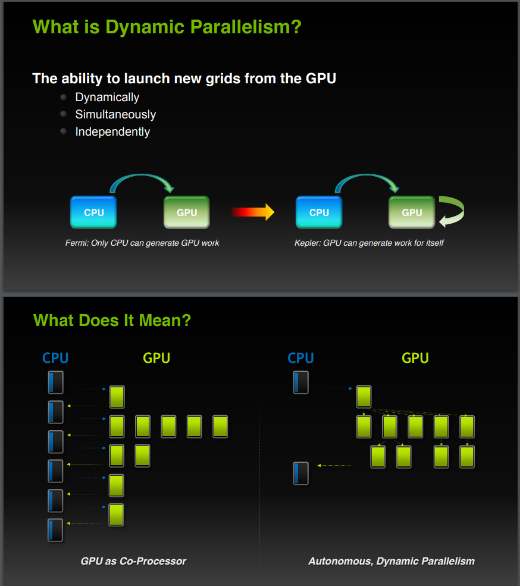

# cuda-practice

Implement alexnet from 0 to 1 as an practice.

## ENV

| device           | cuda |
| ---------------- | ---- |
| GeForce 3080 12G | 11.7 |

cuda 11.7

## pytorch Implement

```
class AlexNet(nn.Module):
    def __init__(self):
        super(AlexNet, self).__init__()
        self.conv = nn.Sequential(
            nn.Conv2d(1, 96, 11, 4), # in_channels, out_channels, kernel_size, stride, padding
            nn.ReLU(),
            nn.MaxPool2d(3, 2), # kernel_size, stride
            # 减小卷积窗口，使用填充为2来使得输入与输出的高和宽一致，且增大输出通道数
            nn.Conv2d(96, 256, 5, 1, 2),
            nn.ReLU(),
            nn.MaxPool2d(3, 2),
            # 连续3个卷积层，且使用更小的卷积窗口。除了最后的卷积层外，进一步增大了输出通道数。
            nn.Conv2d(256, 384, 3, 1, 1),
            nn.ReLU(),
            nn.Conv2d(384, 384, 3, 1, 1),
            nn.ReLU(),
            nn.Conv2d(384, 256, 3, 1, 1),
            nn.ReLU(),
            nn.MaxPool2d(3, 2)
        )
        self.fc = nn.Sequential(
            nn.Linear(256*5*5, 4096),
            nn.ReLU(),
            nn.Dropout(0.5),
            nn.Linear(4096, 4096),
            nn.ReLU(),
            nn.Dropout(0.5),
            nn.Linear(4096, 10),
        )

    def forward(self, img):
        feature = self.conv(img)
        output = self.fc(feature.view(img.shape[0], -1))
        return output
```

## 问题和解决方案

## diary

[ RUN      ] general/test_relu_float_1d_input.check_output_vs_cpu/2
0 th, host_output: 0.340188, fetch_output 0
/home/dongwei/Workspace/cuda-practice/v1/tests/test_operators/test_relu.cu:101: Failure
Expected equality of these values:
  host_output[i]
    Which is: 0.34018773
  fetch_output[i]
    Which is: 0
0 th, host_output: 0.34018772840499878, fetch_output 0

1 th, host_output: 0, fetch_output 0
2 th, host_output: 0.283099, fetch_output 0.283099
3 th, host_output: 0.29844, fetch_output 0.29844
4 th, host_output: 0.411647, fetch_output 0.411647
5 th, host_output: 0, fetch_output 0
6 th, host_output: 0, fetch_output 0
7 th, host_output: 0.26823, fetch_output 0.26823
8 th, host_output: 0, fetch_output 0
9 th, host_output: 0.05397, fetch_output 0.05397
10 th, host_output: 0, fetch_output 0
11 th, host_output: 0.128871, fetch_output 0.128871

第 0 个元素值始终为 0

### v1

将所有算子实现为 __global\_\_ 从主机顺序调用

### Implement Completely alone, check Accuracy and performance

1. Implement relu, test and optimize it

# 新知识



```
# --relocatable-device-code {true|false}          (-rdc)  
#         Enable (disable) the generation of relocatable device code.  If disabled,
#         executable device code is generated.  Relocatable device code must be linked
#         before it can be executed.
#         Default value:  false.
```

# to do

合并 desc 和 T* 为 tensor 类，连续非连续 version，存储位置管理。

网络 parse 功能

智能指针

glog

managedmemery 导致 cuda gdb 卡住？
